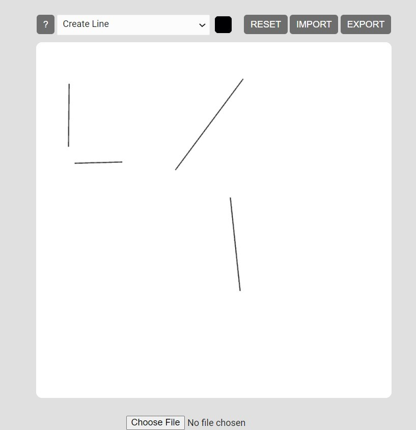
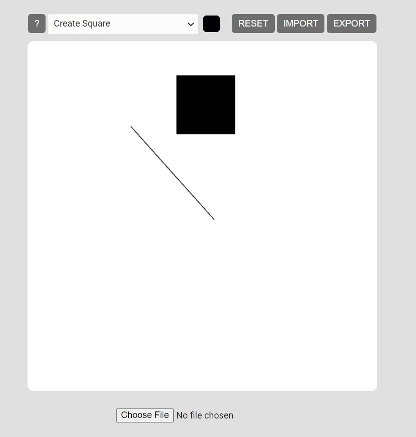
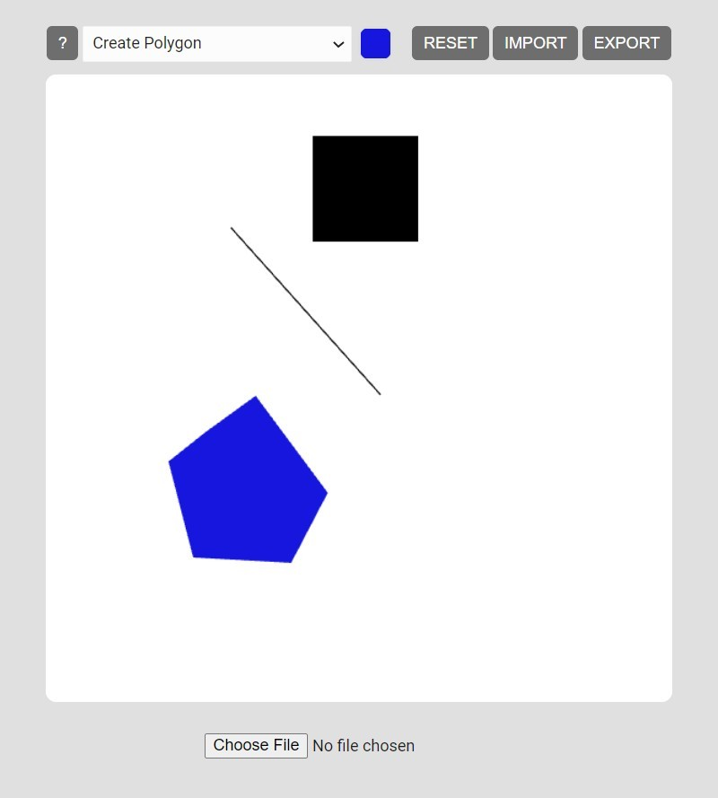
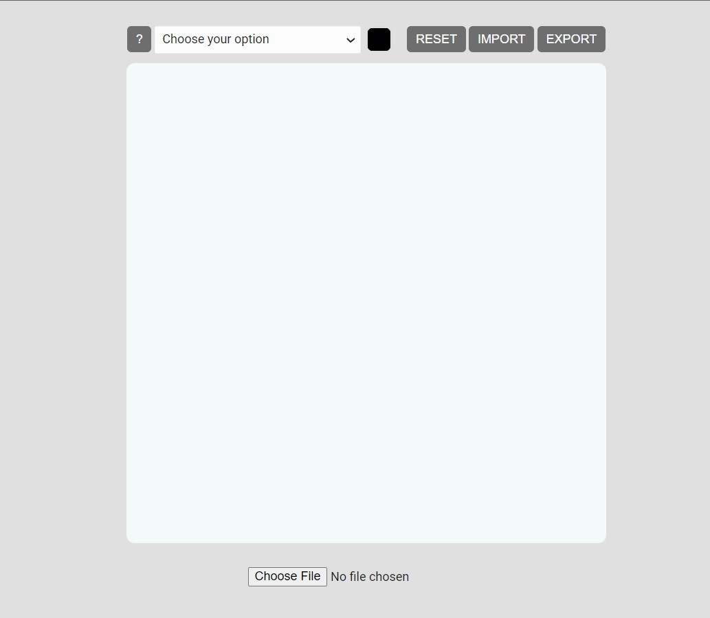
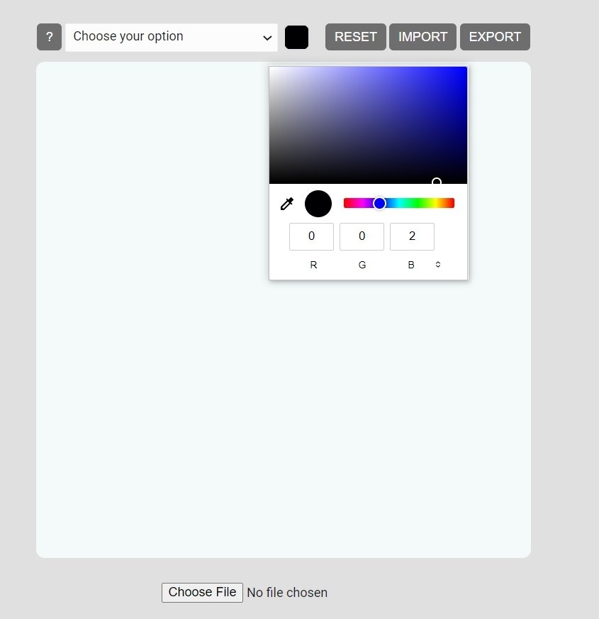
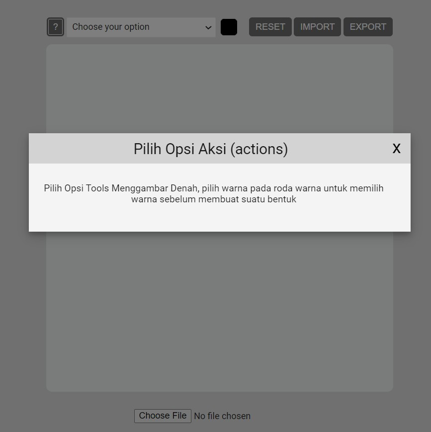
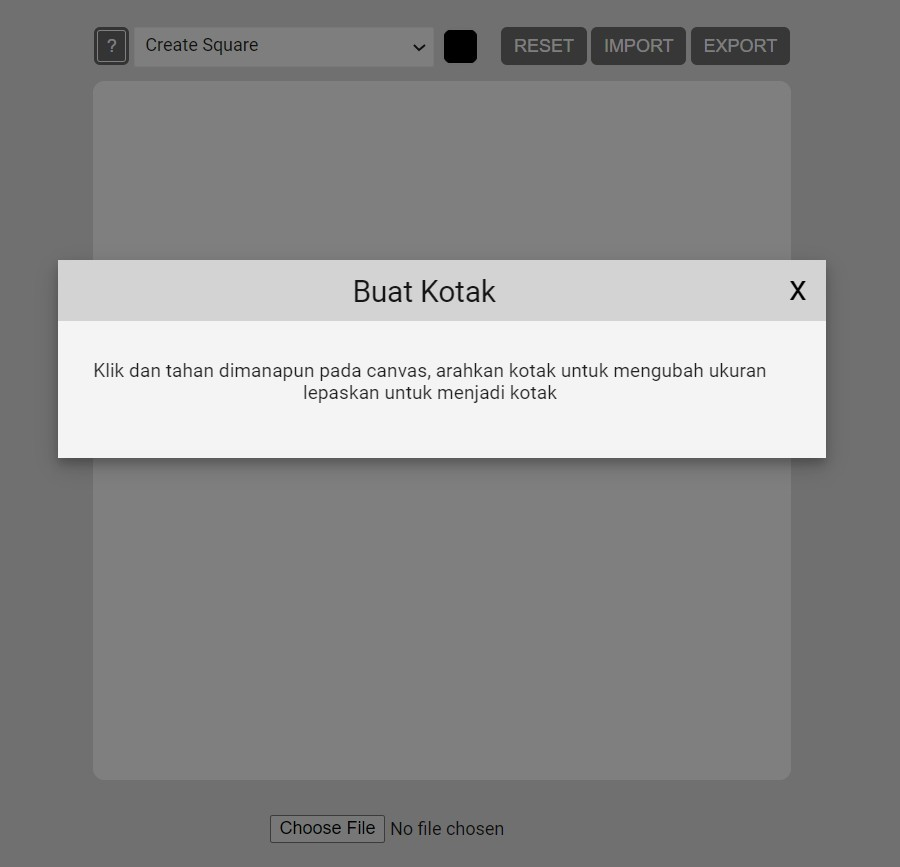

<p align="center">
    
    <h2 align="center">Web Drawer</h2>
</p> 
<p align="center">A simple webgl program that can make your imagination alive</code></p>

> Have you ever wanted to draw (like in the thumbnail :D), but don't have the skill to draw in paper?

Introducing...

A simple webgl program that can make your imagination alive. It only need your imagination and your mouse/trackpad to actually draw things...

## ✨ Features

- Create & Edit Lines
- Create & Edit Squares Object
- Create & Edit Polygon
- Change Colors
- Reset Canvas
- Save & Load Models

### Create & Edit Objects


<table>
  <tr>
    <td valign="mid">
   
    </td> 
    <td valign="mid">
    
    </td> 
    <td valign="mid">
   
    </td> 
  <tr>
    <td><p align="center">Line</p></td>
    <td><p align="center">Square</p></td>
      <td><p align="center">Polygon</p></td>
  </tr>
</table>

### Misc

<table>
  <tr>
    <td valign="mid">
   
    </td> 
    <td valign="mid">
    
    </td> 
    <td valign="mid">
   
    </td> 
    <td valign="mid">
   
    </td> 
  <tr>
    <td><p align="center">Canvas</p></td>
    <td><p align="center">Color Picker</p></td>
      <td><p align="center">Help Guide</p></td>
       <td><p align="center">Help Guide</p></td>
  </tr>
</table>


## 📚 Tech Stack
- WebGL
- Javascript


## 🚀 Quick start

We use <code>live-server</code> to build the webgl project

**Build and run the apps locally**

### Step 1: Clone The Repo
Fork the repository. then clone the repo locally by doing -

```bash
git clone https://github.com/William9923/WebCAD
```
### Step 2: Install the Live Server
[Reference](https://gist.github.com/donmccurdy/20fb112949324c92c5e8)

### Step 3: Run the Live Server
cd into the directory
```bash
cd WebCAD
```

run the live server
```bash
live-server .
```

## ❤️ Support
If you feel that this repo have helped you provide more example on learning software engineering, then it is enough for me! Wanna contribute more? Please ⭐ this repo so other can see it too!